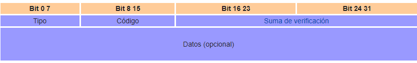

# PING PHP

## DATAGRAMA ICMP(8)

Tipo - Tipo de ICMP como se especifica a continuación. 
Código - Subtipo al tipo dado. 
Checksum - Datos comprobación de errores. Calculado a partir de la cabecera ICMP + datos, con un valor de 0 para este campo. El algoritmo de suma de comprobación se especifica en RFC 1071. 
Resto del Header - Cuatro campo byte. Puede variar en función del tipo y código ICMP. 

Código Valor  
0 Net unreachable 
1 Host unreachable 
2 Protocol unreachable 
3 Port unreachable 
4 Fragmentation needed and don’t fragment bit was set 
5 Source route failed 
6 Destination network unknown 
7 Destination host unknown 
8 Source host isolated 
9 Destination network is administratively prohibited 
10 Destination host is administratively prohibited 
11 Destination network unreacheable for type of service 
12 Destination host unreacheable for type of service 
13 Communication Administratively prohibited 
14 Host precedence violation 
15 Precedence cutoff in effect 

### Mas informacion sobre paquete icmp
(1) http://apuntesdenetworking.blogspot.com/2011/10/tipos-de-mensaje-icmp-internet-control.html  
(2) https://es.wikipedia.org/wiki/Protocolo_de_control_de_mensajes_de_Internet
